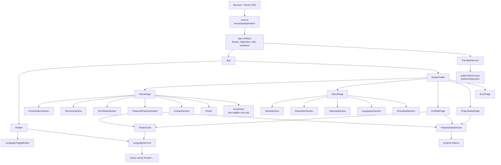

# Architecture

## Overview

Terminal Portfolio is a standalone, feature-organized Angular application. There is no `AppModule` and no feature modules: providers are registered in `ApplicationConfig`, pages are loaded with `loadComponent`, and each component declares its template dependencies directly.

The build combines:

- browser-side rendering;
- static prerendering of the known public pages;
- client-side hydration;
- static output hosted by Vercel.

## Component diagram



## Layers and responsibilities

### Bootstrap and configuration

- `src/main.ts`: bootstraps `App` in the browser.
- `src/app/app.config.ts`: registers Router, scroll restoration, preloading, hydration, HttpClient, and ngx-translate.
- `src/main.server.ts`: adapts the bootstrap process to the rendering context.
- `src/app/app.config.server.ts`: merges the browser providers with `provideServerRendering`.
- `src/server.ts`: creates the Angular engine on top of Express, used by the rendering infrastructure.

### Application shell

`App` is the global shell. It keeps `Header` visible and delegates page content to `RouterOutlet`. It also reads the locale query string and synchronizes the active ngx-translate language.

### Features

| Feature | Responsibility | Main components |
| --- | --- | --- |
| `home` | Presentation, services, stack, featured projects, and contact. | `HomePage` and five sections. |
| `about` | Biography, education, interests, languages, and résumé. | `AboutPage` and five sections. |
| `portfolio` | Full project catalog listing. | `PortfolioPage`, `ProjectCard`. |
| `projectDetail` | Resolves `:id` and displays a single project. | `ProjectDetailPage`. |
| `error` | Shows a visual response for unknown routes. | `ErrorPage`. |

### Home intro lifecycle

`HomeIntroService` is a root-provided, in-memory state machine with four states:

```text
idle ── browser post-hydration start ──► typing
  └── reduced motion ──────────────────► completed
typing ── final character + final pause ► revealing ── animationend ──► completed
typing/revealing ── route destruction ────────────────────────────────► completed
```

`HomePage` owns the structural rendering boundary. `HomeIntro` and its terminal
shell remain mounted across the transition. While the service is `idle` or
`typing`, every secondary `@if` block is absent. Presentation content, services,
stack, projects, contact, and footer are created only in `revealing` or
`completed`, and the reveal animation applies only to those inserted nodes.
Consequently, secondary hooks, image loads, observers, and other side effects
cannot run during typing, while the terminal DOM and cursor animation keep the
same identity.

`HomeIntro` owns one recursively scheduled timeout. Each callback appends one
Unicode code point and schedules at most one successor. It clears the pending
timeout on destruction and reports completion only after the last character is
present. The reusable terminal components contain no lifecycle or timing state.

The sequence is configured in
`src/app/features/home/home-intro.config.ts`. `HOME_INTRO_CONFIG` controls the
initial delay, per-character interval, final pause, cursor blink, and optional
content reveal/duration. Translated command text remains in `public/i18n`.

Browser-only startup and `matchMedia` access run inside `afterNextRender`, which
Angular skips during server rendering and runs after hydration. The server and
initial browser render therefore agree on the intro-only tree. A non-home
initial route never constructs `HomeIntro` and does not consume the sequence.
Reduced-motion users transition to the complete tree at that post-hydration
boundary without typing or reveal animation.

### Core and shared

- `core/layout`: structural components, including the header, footer, and the visual composition that simulates a terminal.
- `core/shared`: reusable UI elements, such as the button, title, language toggle, and project card.

### Data and services

`projects.data.ts` is the local, typed source of the catalog. There is no remote API and no persistent storage. `ProjectsDataService` exposes three read-only operations:

- list all projects;
- find a project by id;
- filter featured projects.

`LanguageService` keeps the current locale in a `BehaviorSubject`, tracks `NavigationEnd`, preserves the language across navigation, and updates the query string. `TranslateService` is responsible for loading and resolving the translated text.

## Routes and rendering

| Route | Page | Loading | Rendering |
| --- | --- | --- | --- |
| `/` | `HomePage` | Lazy | Prerendered |
| `/about` | `AboutPage` | Lazy | Prerendered |
| `/portfolio` | `PortfolioPage` | Lazy | Prerendered |
| `/portfolio/:id` | `ProjectDetailPage` | Lazy | Client |
| `**` | `ErrorPage` | Lazy | Client |

The build uses `outputMode: "static"`. The prerendering step generates HTML for the three static routes and a CSR shell for the client-rendered routes.

## Project data flow

```text
projects.data.ts
      │
      ▼
ProjectsDataService
      ├── getFeaturedProjects() ──► FeaturedProjectsSection
      ├── getAllProjects() ───────► PortfolioPage
      └── getProjectById(id) ─────► ProjectDetailPage
                                         ▲
                                         │ :id
ProjectCard ── locale-aware navigation ──► Router
```

Components receive typed `Project` objects. Titles and descriptions are not stored in this catalog; they are resolved from the translation files, using the id as part of the key.

## Language flow

1. `App` reads `locale` from the route.
2. The locale is normalized to `en` or `pt`.
3. `TranslateService.use()` loads `public/i18n/<language>.json`.
4. `TranslatePipe` updates the templates.
5. `LanguageService` preserves the locale when navigating between pages and projects.
6. The language button toggles the state and updates the URL.

English is the initial and fallback language. The loader is configured with `failOnError: true`; a missing catalog is treated as an error instead of silently resulting in empty translations.

## Styles

Each component has encapsulated SCSS. Shared styles live in `src/styles`:

- `abstracts/_variables.scss`: tokens and variables;
- `abstracts/_animations.scss`: reusable animations;
- `styles.scss`: global stylesheet registered in `angular.json`.

`stylePreprocessorOptions.includePaths` allows importing resources from `src/styles`.

## Testing

The `@angular/build:unit-test` builder runs Vitest on top of jsdom. Every component has a spec file. `src/test-setup.ts` provides Router and ngx-translate to all tests, reducing repeated setup.

## Build and delivery

```text
Source code
   │ npm ci
   ▼
Angular 22 build + prerender
   │
   └── dist/portfolio/browser
             │
             ▼
        Vercel Edge CDN
```

`vercel.json` selects the Angular preset, runs `npm ci` and `npm run build`, and publishes only `dist/portfolio/browser`. The project does not require any environment variables in its current state.
