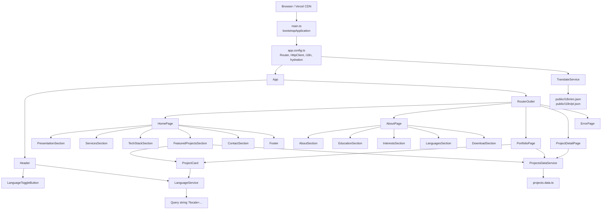

# Arquitetura

## Visão geral

O Terminal Portfolio é uma aplicação Angular standalone, organizada por funcionalidades. Não há `AppModule` nem módulos de feature: providers são registrados em `ApplicationConfig`, páginas são carregadas com `loadComponent` e cada componente declara diretamente suas dependências de template.

O build combina:

- renderização no browser;
- pré-renderização estática das páginas públicas conhecidas;
- hidratação no cliente;
- saída estática hospedada pela Vercel.

## Diagrama de componentes



## Camadas e responsabilidades

### Bootstrap e configuração

- `src/main.ts`: inicializa `App` no browser.
- `src/app/app.config.ts`: registra Router, scroll restoration, preload, hidratação, HttpClient e ngx-translate.
- `src/main.server.ts`: adapta o bootstrap ao contexto de renderização.
- `src/app/app.config.server.ts`: combina os providers do browser com `provideServerRendering`.
- `src/server.ts`: cria o engine Angular sobre Express usado pela infraestrutura de renderização.

### Shell da aplicação

`App` é o shell global. Ele mantém o `Header` visível e delega o conteúdo da página ao `RouterOutlet`. Também interpreta a query string de locale e sincroniza o idioma ativo do ngx-translate.

### Features

| Feature | Responsabilidade | Componentes principais |
| --- | --- | --- |
| `home` | Apresentação, serviços, stack, projetos em destaque e contato. | `HomePage` e cinco seções. |
| `about` | Biografia, educação, interesses, idiomas e currículo. | `AboutPage` e cinco seções. |
| `portfolio` | Lista completa do catálogo de projetos. | `PortfolioPage`, `ProjectCard`. |
| `projectDetail` | Resolve `:id` e apresenta um projeto individual. | `ProjectDetailPage`. |
| `error` | Exibe uma resposta visual para rotas desconhecidas. | `ErrorPage`. |

### Core e compartilhados

- `core/layout`: componentes estruturais, incluindo cabeçalho, rodapé e a composição visual que simula um terminal.
- `core/shared`: elementos reutilizáveis de interface, como botão, título, seletor de idioma e card de projeto.

### Dados e serviços

`projects.data.ts` é a fonte local tipada do catálogo. Não há API remota nem armazenamento persistente. `ProjectsDataService` fornece três operações somente leitura:

- listar todos os projetos;
- localizar um projeto pelo id;
- filtrar projetos em destaque.

`LanguageService` mantém o locale atual em um `BehaviorSubject`, acompanha `NavigationEnd`, preserva o idioma durante navegação e altera a query string. O `TranslateService` é responsável por carregar e resolver os textos traduzidos.

## Rotas e renderização

| Rota | Página | Carregamento | Renderização |
| --- | --- | --- | --- |
| `/` | `HomePage` | Lazy | Pré-renderizada |
| `/about` | `AboutPage` | Lazy | Pré-renderizada |
| `/portfolio` | `PortfolioPage` | Lazy | Pré-renderizada |
| `/portfolio/:id` | `ProjectDetailPage` | Lazy | Cliente |
| `**` | `ErrorPage` | Lazy | Cliente |

O build usa `outputMode: "static"`. A etapa de pré-renderização gera HTML para as três rotas estáticas e um shell CSR para as rotas executadas no cliente.

## Fluxo de projetos

```text
projects.data.ts
      │
      ▼
ProjectsDataService
      ├── getFeaturedProjects() ──► FeaturedProjectsSection
      ├── getAllProjects() ───────► PortfolioPage
      └── getProjectById(id) ─────► ProjectDetailPage
                                         ▲
                                         │ :id
ProjectCard ── navegação com locale ──► Router
```

Os componentes recebem objetos `Project` tipados. Títulos e descrições não ficam nesse catálogo; são resolvidos nos arquivos de tradução usando o id como parte da chave.

## Fluxo de idioma

1. `App` lê `locale` da rota.
2. O locale é normalizado para `en` ou `pt`.
3. `TranslateService.use()` carrega `public/i18n/<idioma>.json`.
4. `TranslatePipe` atualiza os templates.
5. `LanguageService` preserva o locale ao navegar entre páginas e projetos.
6. O botão de idioma alterna o estado e atualiza a URL.

O inglês é o idioma inicial e de fallback. O loader está configurado com `failOnError: true`; a ausência de um catálogo é tratada como erro em vez de resultar silenciosamente em traduções vazias.

## Estilos

Cada componente possui SCSS encapsulado. Estilos compartilhados vivem em `src/styles`:

- `abstracts/_variables.scss`: tokens e variáveis;
- `abstracts/_animations.scss`: animações reutilizáveis;
- `styles.scss`: folha global registrada no `angular.json`.

`stylePreprocessorOptions.includePaths` permite importar recursos a partir de `src/styles`.

## Testes

O builder `@angular/build:unit-test` executa Vitest sobre jsdom. Cada componente possui um spec. `src/test-setup.ts` fornece Router e ngx-translate para todos os testes, reduzindo configuração repetida.

## Build e entrega

```text
Código-fonte
   │ npm ci
   ▼
Angular 22 build + prerender
   │
   └── dist/portfolio/browser
             │
             ▼
        Vercel Edge CDN
```

O `vercel.json` escolhe o preset Angular, executa `npm ci` e `npm run build`, e publica somente `dist/portfolio/browser`. O projeto não exige variáveis de ambiente no estado atual.
